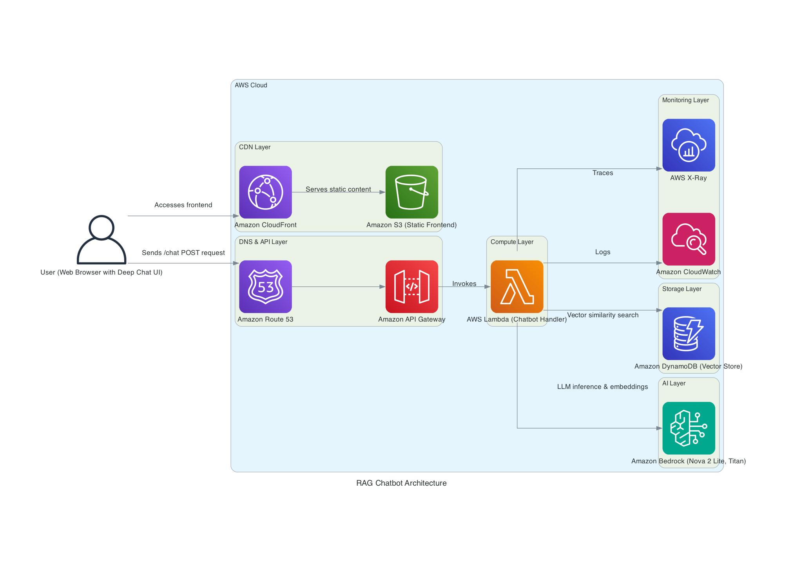

# Virtual Me - AI-Powered Personal Chatbot


A "Virtual Clone" chatbot that answers questions about you using **Retrieval Augmented Generation (RAG)**. It grounds all responses in your personal data (resume, bio, etc.) to prevent hallucinations.

---

## Architecture



> [!NOTE]
> The diagram above is generated using the [Diagrams](https://diagrams.mingrammer.com/) library via the `rag_chatbot_architecture.py` script.

**Flow:**
1. User sends a question via the Deep Chat UI
2. Route 53 → API Gateway → Lambda
3. Lambda runs the RAG pipeline:
   - Embeds the question using **Bedrock Titan**
   - Searches **DynamoDB** for relevant context (cosine similarity)
   - Generates a grounded response using **Bedrock Nova 2 Lite**
4. Response returned to user

---

## Key Technologies

| Layer | Technology |
|-------|------------|
| **Frontend** | Deep Chat UI, CloudFront, S3 |
| **API** | API Gateway (HTTP API) |
| **Compute** | AWS Lambda (Python 3.11) |
| **LLM** | Amazon Bedrock (Nova 2 Lite) |
| **Embeddings** | Amazon Bedrock (Titan Embed) |
| **Vector Store** | DynamoDB (custom cosine similarity) |
| **Orchestration** | LangGraph state machine |
| **IaC** | Terraform |

### Technical Decisions

> **Serverless Vector Search**
> We use standard DynamoDB with client-side cosine similarity. Zero cost at rest, 10ms retrieval latency.
> *(See [Deep Dive: Data Strategy](DEEP_DIVE.md#5-data-storage-strategy))*
>
> **L1 Cold Start Optimization**
> Global singleton pattern saves **4s** of latency by compiling the LangGraph workflow only once per **Execution Environment** (the micro-VM where Lambda runs).
> *(See [Deep Dive: Production Engineering](DEEP_DIVE.md#4-production-engineering))*
>
> **Sliding Window Context**
> Uses a safe sliding window for conversation history to keep token usage within limits.
> *(See [Deep Dive: Context Sliding Window](DEEP_DIVE.md#context-sliding-window))*

---

## How RAG Works

The RAG pipeline uses LangGraph to orchestrate two nodes:

### 1. Retrieve Node
Converts the user question to an embedding vector and searches DynamoDB for the most similar document chunks:

```python
# Cosine similarity search
def similarity_search(query_embedding, k=3):
    # Scan all documents, compute similarity, return top k
    results.sort(key=lambda x: x[1], reverse=True)
    return results[:k]
```

### 2. Generate Node
Combines retrieved context with the question and calls the LLM:

```python
SYSTEM_PROMPT = """You are a Virtual Clone representing the person in the context.
Answer ONLY using information from the CONTEXT below.
If the answer isn't in the context, say "I don't have that information."

CONTEXT:
{context}
"""
```

The LangGraph workflow:
```
START → retrieve_node → generate_node → END
```

---

## Quick Start (Local Development)

### Prerequisites
- Python 3.11+
- [LM Studio](https://lmstudio.ai) for local LLM (optional)
- AWS credentials (for Bedrock)

### Setup

```bash
# Clone and setup
git clone <repo-url> && cd virtualme
python -m venv .venv && source .venv/bin/activate
pip install -r requirements.txt

# Configure environment
cp .env.example .env
# Edit .env with your settings

# Run locally
cd src && python lambda_function.py
```

---

## AWS Deployment

```bash
# Configure AWS credentials
aws configure

# Deploy infrastructure
cd terraform
cp terraform.tfvars.example terraform.tfvars
# Edit terraform.tfvars

terraform init
terraform apply
```

**Deployed endpoints:**
- Frontend: `https://chat.lemaire.tel`
- API: `https://api.lemaire.tel/chat`

---

## Configuration

| Variable | Default | Description |
|----------|---------|-------------|
| `LLM_BACKEND` | `bedrock` | `bedrock` or `lm_studio` |
| `LLM_MODEL` | `nova-2-lite` | Model alias (see below) |
| `LLM_TEMPERATURE` | `0.3` | Response creativity (0.0-1.0) |
| `EMBEDDING_MODEL` | `titan-embed-text-v2` | Embedding model |
| `DYNAMODB_TABLE` | auto | Vector storage table |

**Available LLM Models:**
- `nova-2-lite` (default, best value)
- `nova-2-pro` (more capable)
- `claude-3-haiku` (Anthropic)
- `llama-3.2-3b`, `llama-3.2-8b` (Meta)

---

## Customizing Your Knowledge Base

Add or edit markdown files in `src/knowledge_base/`. All `.md` files are automatically loaded:

```markdown
# Your Name

## Professional Summary
Your background and expertise...

## Experience
### Company Name
Your role and achievements...
```

Redeploy to update the vector store.

---

## Cost Estimate

For personal use (~100 conversations/month): **~$3-5/month**

| Service | Estimated Cost |
|---------|---------------|
| Lambda + API Gateway | $0.30 - $1.00 |
| DynamoDB | $1.00 - $5.00 |
| Bedrock (Nova 2 Lite) | $0.50 - $2.00 |
| S3 + CloudFront | $0.15 - $0.50 |
| Route53 | $0.50 |

---

## Testing

### 1. Unit Tests (Mocked)
Fast, in-memory tests that don't require external services.
```bash
# Source venv and run pytest
source .venv/bin/activate
python3 -m pytest tests/ -v
```

### 2. Local Functional Test (LM Studio)
Tests the actual RAG logic using a local LLM. 
```bash
# 1. Install development dependencies
pip3 install -r requirements-dev.txt

# 2. Start LM Studio (with a model like Ministral 3 14B loaded)

# 3. Run the functional test
python3 test_local.py
```

### 3. Bedrock Connectivity Check
Verifies AWS permissions for Bedrock in `eu-west-3`.
```bash
./scripts/verify-bedrock-access.sh
```

---

## Project Structure

```
virtualme/
├── src/                    # Lambda source code
│   ├── lambda_function.py  # Entry point
│   ├── config.py           # Configuration
│   ├── rag/                # RAG pipeline (pipeline, retriever, generator)
│   ├── vectorstores/       # DynamoDB vector store
│   └── knowledge_base/     # Your resume/bio data
├── frontend/               # Deep Chat UI
├── terraform/              # AWS infrastructure
├── tests/                  # Unit tests
└── generated-diagrams/     # Architecture diagrams
```

---
Built with AWS Lambda, Amazon Bedrock, LangGraph, and DynamoDB
